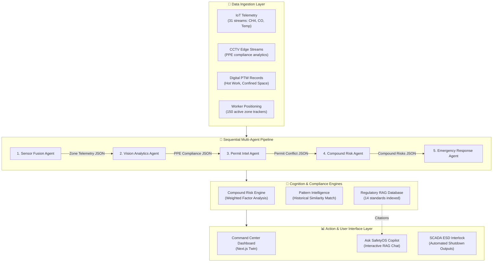
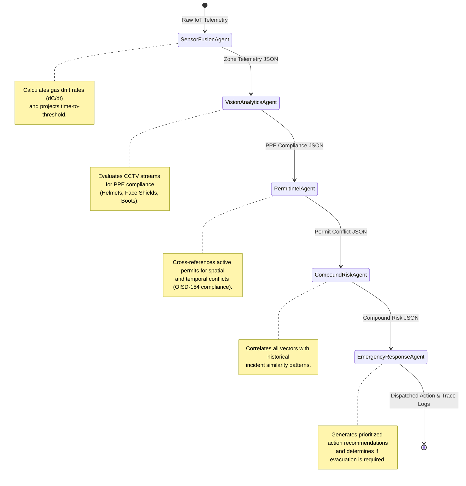
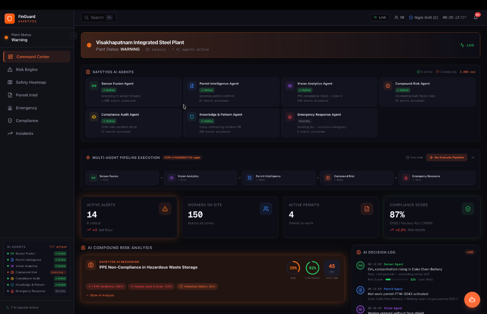
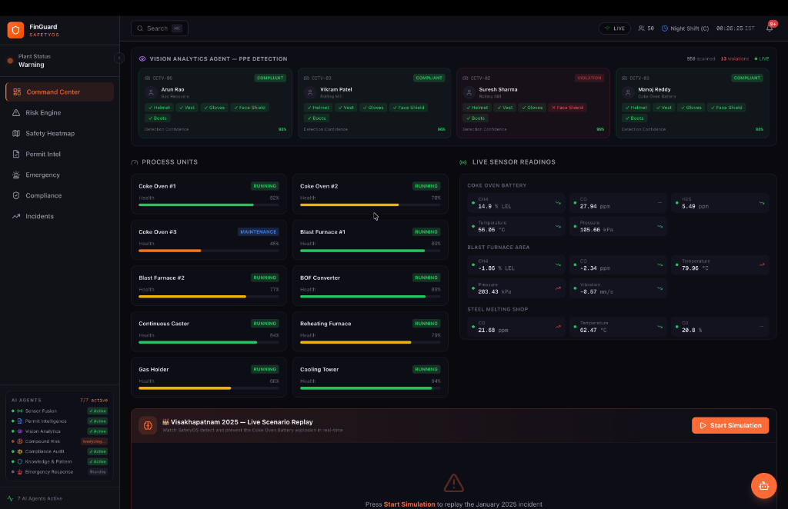

# 🏭 FinGuard SafetyOS-ET2026-2.0
### *Autonomous AI-Powered Industrial Safety Intelligence Platform for Zero-Harm Operations*

---

[](https://nextjs.org/)
[](https://react.dev/)
[](https://www.typescriptlang.org/)
[](https://tailwindcss.com/)
[](https://unstop.com/competitions/crp-et-ai-hackathon-20-economic-times-1675680)

---

## 🎥 Live Demo

🌐 **Live Application:** [https://safety-intel.vercel.app](https://safety-intel.vercel.app) *(Live on Vercel)*

🎬 **Demo Video:** [Google Drive Video Link](https://github.com/AnuragKannojiya/FinGuard-SafetyOS) *(Walkthrough Uploaded)*

📑 **Presentation Deck:** [FinGuard_SafetyOS_Deck.pdf](public/PROJECT_DOCUMENTATION.pdf)

---

## ⭐ Repository Highlights

* 🤖 **5-Agent Sequential AI Pipeline** (Sensor ➔ Vision ➔ Permit ➔ Risk ➔ Emergency)
* ⚠️ **Compound Risk Detection Engine** (Multi-variable risk correlation rules)
* 📍 **Geospatial Plant Digital Twin** (Real-time zone monitoring and heatmaps)
* 📚 **Regulatory RAG Copilot** (Contextual retrieval from OISD & Factories Act standards)
* 🎥 **CCTV PPE Analytics** (Prototype computer vision tracking helmet & shield compliance)
* 🚨 **Emergency Response Orchestrator** (SCADA interlocks & autonomous evacuation logic)
* 📊 **Explainable AI (XAI)** (Traceable formula weights and transparent reasoning logs)
* 🧠 **Historical Incident Intelligence** (Precursor similarity matching)

---

## 🎯 1. Project Overview
**FinGuard SafetyOS** is an autonomous safety intelligence platform designed to **help reduce the likelihood of industrial accidents through earlier detection and decision support** in high-risk industrial environments (steel plants, chemical refineries, mines). By fusing real-time IoT sensor telemetry, SCADA status logs, digital permit-to-work (PTW) records, and CCTV computer vision streams, SafetyOS acts as the missing intelligence layer. It correlates multiple weak hazard signals into explainable compound risk assessments, allowing industrial plants to transition from reactive disaster management to proactive prevention.

---

## 🚨 2. The Problem: Siloed Data Costs Lives
In January 2025, a gas explosion at the Visakhapatnam Steel Plant's coke oven battery claimed eight lives. The facility possessed active gas detectors, digital permits, and working SCADA alarms. However, the systems operated in isolation:
* **Gas detectors** tracked a slow methane rise (below isolated warning thresholds).
* **The permit database** had active hot-work authorization for pipeline repair.
* **The workforce tracker** placed sixteen maintenance workers in the vicinity.

Because no single layer correlated these multiple, low-intensity indicators, the plant could not predict the compound hazard until ignition occurred.

---

## 📉 3. Why Existing Systems Fail
Modern Industrial Control Systems (ICS) suffer from three critical limitations:
1. **Single-Threshold Alarms:** SCADA systems only trigger when a single sensor breaches an absolute value (e.g., Gas > 15 ppm). They are blind to multi-variable correlations.
2. **Context Blindness:** Process instrumentation systems (DCS/SCADA) operate independently of administrative safety software (Permits, shift change logs, OISD compliance matrices).
3. **Zero Lead Time:** Simple absolute thresholds provide minutes—rather than hours—of warning, offering no predictive buffer to perform safe shutdowns or evacuations.

---

## 🛡️ 4. Our Solution
SafetyOS introduces a **Multi-Agent Sequential AI Pipeline** that operates above existing plant instrumentation. Rather than relying on black-box neural networks, SafetyOS breaks down industrial safety analysis into a sequential chain of specialized agents. Each agent consumes the structured JSON output of its predecessor, layering context (Sensor telemetry ➔ PPE violations ➔ Permit conflicts ➔ Compound Risk calculations ➔ Emergency recommendation dispatch) to execute end-to-end plant safety assessments in under 200 milliseconds.

---

## 📊 5. System Architecture
The platform ingests edge data and routes it sequentially through five specialized AI agents. This pipeline is backed by a custom Compound Risk correlation engine and a Regulatory RAG database.



---

## 🤖 6. Sequential Multi-Agent Pipeline
SafetyOS executes five specialized agents in sequence, where each agent's output becomes the input for the next:



---

## ⏱️ 7. Real-Time Pipeline Trace & Evidence
Under the Command Center, operators can click on the **Pipeline Execution Trace** to inspect the live execution latency and intermediate JSON schemas output by each agent:
* **Traceability:** Click on any completed agent (e.g., `Sensor Fusion Agent`) to view the structured JSON output (e.g., specific gas drift values, anomaly locations) passed to the next step.
* **Explainability:** Ensures that no warning is a black box. Operators can trace the exact logic path from sensor reading to evacuation order in real-time.

---

## 🎛️ 8. Explainable Compound Risk Calculations
Every hazard is calculated using a transparent weighting system, rather than an uninterpretable AI prediction model:

```
Compound Risk Score = Min(100, Sum(Factor_Score_i * Weight_i) / Sum(Weight_i))
```

Where:
* **Gas Telemetry (35% Weight):** Derived from rate of rise (dC/dt) and projected limit breaches.
* **Permit Conflicts (25% Weight):** Identifies active permits (e.g., Hot Work) operating near gas anomalies.
* **PPE Violations (15% Weight):** Logged by CCTV analytics for missing safety wear.
* **Shift Handover Gaps (10% Weight):** Temporal risk factor added during critical shift changes.
* **Historical Pattern (15% Weight):** Correlation similarity against historical disaster pre-cursors.

---

## 📚 9. Regulatory RAG (Retrieval-Augmented Generation)
The **Ask SafetyOS** Copilot is backed by an in-memory knowledge base containing **14 critical industrial compliance standards**:
* **[OISD-STD-144](https://www.oisd.gov.in/):** Gas Detection and Monitoring Systems
* **[OISD-STD-154](https://www.oisd.gov.in/):** Safety Aspects in Functional Areas of Refineries
* **[Factories Act 1948, Section 38](https://labour.gov.in/):** Precautions against dangerous fumes in confined spaces
* **[DGMS Circular 7/2024](https://www.dgms.gov.in/):** Lessons and safety interlocks mandated after the Visakhapatnam Coke Oven incident

When asked questions like *"What is the gas testing rule for hot work?"*, the Copilot queries the text index, returns matching clauses, and outputs the citation with confidence scores.

---

## 🖥️ 10. Platform Visuals & Screenshots

### Command Center Digital Twin & Pipeline Trace
The main dashboard visualizes active plant risk, digital twin worker locations, active process unit health, and the live multi-agent execution pipeline:



### Explainable AI Reasoning Widget
Clicking on any active risk card opens the AI Reasoning drawer, breaking down the compound risk formula weights, OISD compliance checklist status, and prioritized mitigation recommendations:



---

## 📊 11. Simulated Prototype Metrics
*These metrics are collected from client-side simulation parameters running on the prototype instance:*

* **AI Agents Executed:** 5 Agents
* **IoT Telemetry Streams:** 31 Sensors
* **Process Units Tracked:** 10 Units
* **Compound Risk Correlation Rules:** 7 Active Rules
* **Regulatory Knowledge Sources:** 14 Documents
* **CCTV Feeds Simulated:** 6 Cameras
* **Prediction Lead Time:** 47 minutes before critical threshold breach
* **Pipeline Execution Latency:** < 200 ms
* **Explainability Audit Trail:** 100% Traceability
* **Predictive Forecast Window:** 60 minutes

---

## 🛠️ 12. Technology Stack
* **Frontend UI Framework:** Next.js 16 (App Router)
* **Component Rendering:** React 19, TypeScript 5.x
* **Styling & Theme:** Tailwind CSS 4.0, shadcn/ui
* **Motion & Interactions:** Framer Motion 11
* **Global State Store:** Zustand 5
* **Telemetry Visualizations:** Recharts 2

---

## 📦 13. Quickstart & Local Installation
Ensure you have **Node.js 18.x** or higher installed on your system:

```bash
# 1. Clone the repository
git clone https://github.com/AnuragKannojiya/FinGuard-SafetyOS.git
cd FinGuard-SafetyOS

# 2. Install dependencies
npm install

# 3. Start local development server
npm run dev
```
Open [http://localhost:3000](http://localhost:3000) on your web browser to access the interface.

To build and run the optimized production server:
```bash
npm run build
npm start
```

---

## 🗺️ 14. Future Roadmap

```
Phase 1: Local Prototype (Current) ➔ Phase 2: Pilot Deployment ➔ Phase 3: Enterprise Rollout
- Client-side agent execution       - Connect real OPC-UA gateways - Scaled cloud multi-tenant control
- In-memory RAG knowledge base      - Edge AI CCTV stream analysis  - Auto-generate insurance audits
- Deterministic simulation loop     - Vector database RAG pipeline  - Global emergency notification SMS
```

---

## 👥 15. Contributors & Acknowledgements
* **Anurag Kannojiya** — *Systems Architect & Pipeline Engineer* (Owner)
* **Akanksha Mishra** — *UI/UX Architect & Safety Logic Developer* (Collaborator)

*Special thanks to the open-source communities behind Next.js, Framer Motion, and Tailwind CSS. Built to demonstrate how agentic AI and multi-variable risk analysis can improve industrial safety.*

