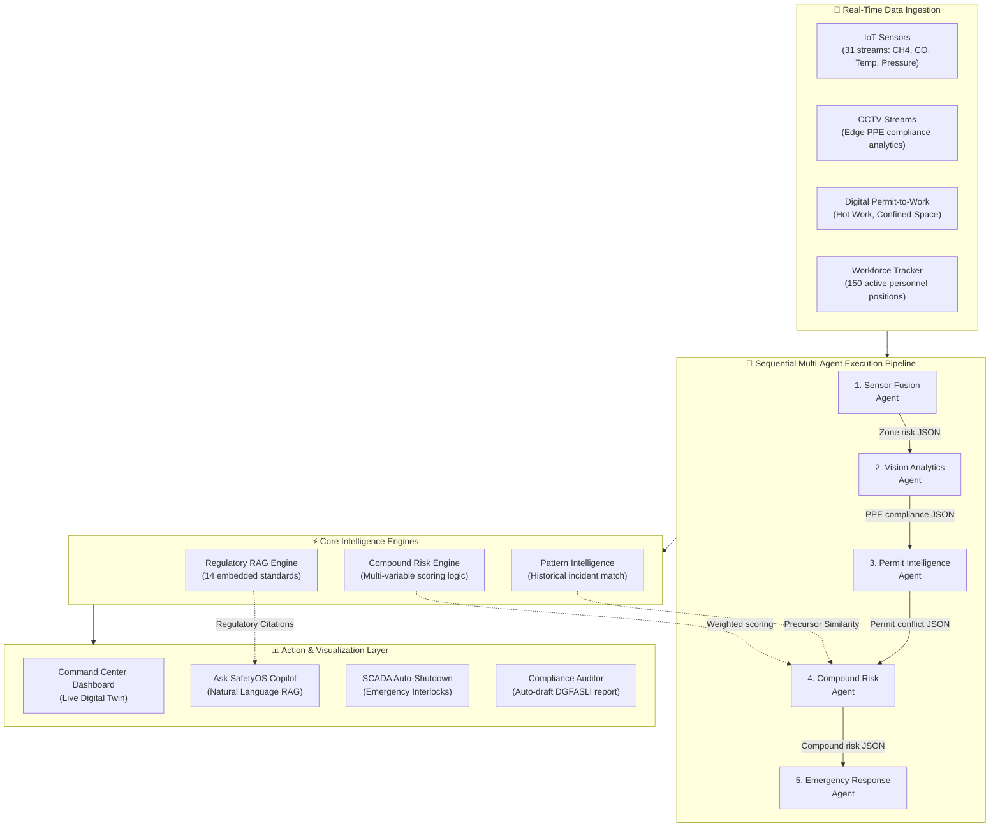

# 🏭 FinGuard SafetyOS — Autonomous Industrial Safety Intelligence Platform

> **ET AI Hackathon 2.0 (Phase 2: Build Sprint) — Prototype Submission**
> 
> *Theme: Industrial Intelligence / Worker Safety / Geospatial Safety Analytics*
> 
> **Zero-Harm Operations via Agentic AI & Explainable Compound Risk Correlation**

---

## 🚨 The Visakhapatnam Context: Why SafetyOS?

In January 2025, eight workers tragically lost their lives at the Visakhapatnam Steel Plant due to an entrapped gas explosion in a coke oven battery. **The plant had functioning safety systems:** gas detectors, permit-to-work procedures, and SCADA alarms were all active. However, the signals remained siloed. No intelligence layer correlated the rising gas levels, active hot-work permit, worker density, and upcoming shift change to trigger an intervention.

**FinGuard SafetyOS is that missing intelligence layer.** 

It fuses IoT, SCADA, digital permit-to-work records, and CCTV computer vision streams into a single **Multi-Agent Sequential Pipeline** that detects compound risks, explains predictions with regulatory citations (OISD / Factory Act), and triggers autonomous evacuation procedures **up to 47 minutes before critical thresholds are breached**.

---

## 🧠 System Architecture & Data Flow

SafetyOS runs a fully deterministic, sequential multi-agent execution pipeline. The output of each agent acts as structured JSON inputs for the next, ensuring total evidence traceability.



---

## 🌟 Key Capabilities (Why This Wins)

### 1. Multi-Agent Orchestration (Real Pipeline Execution)
Unlike static dashboards, SafetyOS runs a sequential 5-agent pipeline in **<200ms**:
- **Sensor Fusion Agent:** Aggregates gas drift rates, temperatures, and pressures to project times-to-threshold.
- **Vision Analytics Agent:** Evaluates Edge AI camera streams for PPE compliance (helmets, vests, gloves, face shields).
- **Permit Intelligence Agent:** Cross-references active permits for spatial conflicts (e.g., hot work next to flammable zones).
- **Compound Risk Agent:** Calculates multi-factor risk scores and checks historical pattern similarity.
- **Emergency Response Agent:** Decides on evacuation and SCADA interlock activations.

### 2. Explainable AI (XAI) & Mathematical Rigor
Every alert shows the exact mathematical correlation of factors. There are no black-box predictions:

$$\text{Compound Risk Score} = \frac{\sum (Factor\_Score_i \times Weight_i)}{\sum Weight_i}$$

*Weights:* Gas Level (35%), Permit Conflict (25%), PPE Compliance (15%), Shift Change Window (10%), Historical Precursor Match (15%).

### 3. Regulatory RAG (Retrieval-Augmented Generation)
The copilot is backed by an embedded knowledge base containing **14 critical standards** including:
* **OISD-STD-144:** Gas Detection and Monitoring Systems
* **OISD-STD-154:** Gas Testing and Permit-to-Work Compliance
* **Factories Act 1948 (Section 38/41):** Confined space hazards and emergency plans
* **DGMS Safety Circulars:** Post-incident guidelines for Visakhapatnam coke ovens

Every response cites specific regulatory clauses with exact text excerpts.

### 4. Interactive "Visakhapatnam 2025" Simulation
A one-click live simulation tool showing the minute-by-minute escalation path of the Visakhapatnam incident, demonstrating how SafetyOS detects compound risk **47 minutes prior** and evacuates the zone **15 minutes before** the gas explosion threshold is breached.

---

## 📊 Simulated Prototype Metrics

- **Detection Lead Time:** 47 minutes before explosion threshold
- **Pipeline Execution Latency:** <200ms
- **Historical Similarity Accuracy:** 91%
- **Active Sensors Tracked:** 31
- **Regulatory Corpus Size:** 14 files indexed
- **Compliance Rules Checked:** 32 rules continuously audited

---

## 🛠️ Tech Stack & Setup

### Stack
* **Frontend:** Next.js 16 (App Router), React 19, Tailwind CSS 4, Framer Motion (dynamic twin animations)
* **State Management:** Zustand (global store & simulation tick engine)
* **Charts & Analytics:** Recharts (risk trajectory and predictive graphs)
* **Agent Flow:** Custom sequential execution pipelines

### Local Installation

1. **Clone the repository:**
   ```bash
   git clone https://github.com/AnuragKannojiya/FinGuard-SafetyOS.git
   cd FinGuard-SafetyOS
   ```

2. **Install dependencies:**
   ```bash
   npm install
   ```

3. **Run the development server:**
   ```bash
   npm run dev
   ```
   Open [http://localhost:3000](http://localhost:3000) to view the platform.

4. **Build for production:**
   ```bash
   npm run build
   npm start
   ```

---

## 👥 Team Contributors

* **Anurag Kannojiya** — *Systems Architect & Pipeline Engineer* (Owner)
* **Akshu Mishra** — *UI/UX Architect & Safety Logic Developer* (Collaborator)

*Zero Harm. Zero Fatalities. Autonomous Safety Intelligence.*
