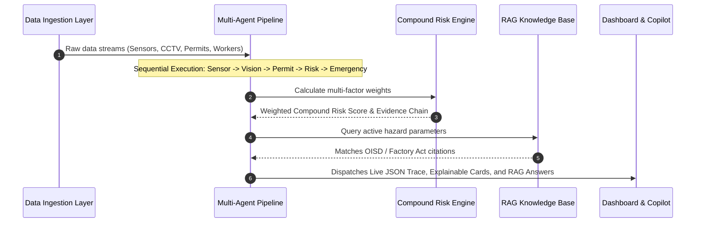
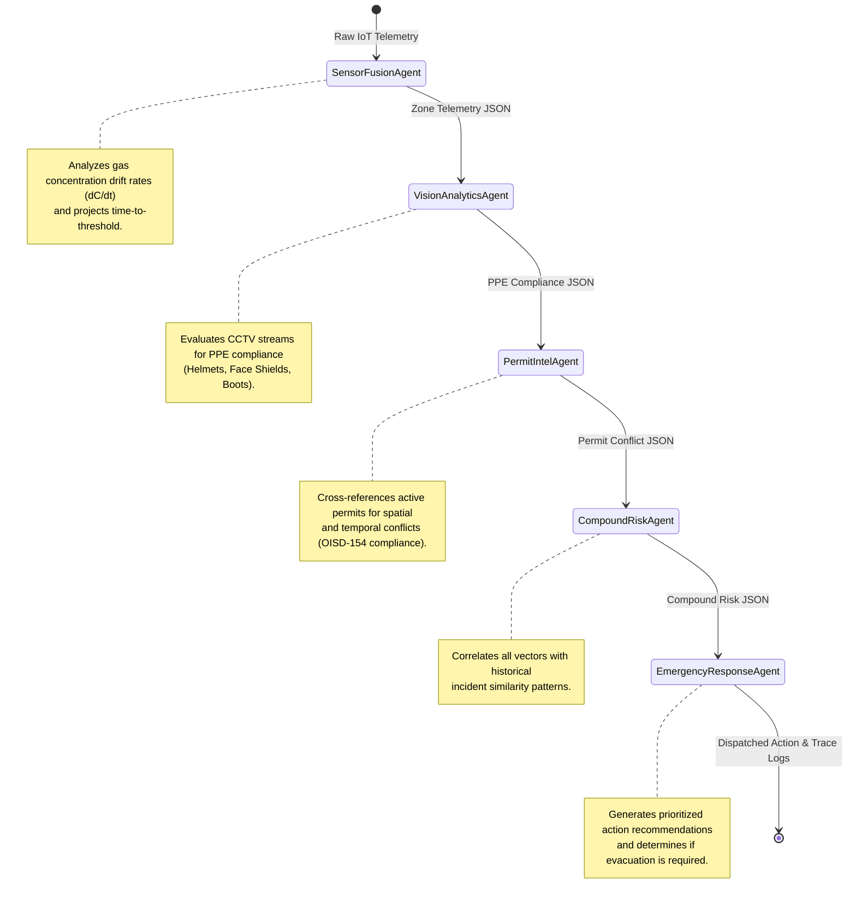

# 🏭 FinGuard SafetyOS

### *Autonomous AI-Powered Industrial Safety Intelligence Platform for Zero-Harm Operations*

---

[](https://nextjs.org/)
[](https://react.dev/)
[](https://www.typescriptlang.org/)
[](https://tailwindcss.com/)
[](LICENSE)
[](https://unstop.com/)

---

## 📖 1. Hero Banner

```
███████  █████  ███████ ███████ ████████ ██ ██    ██  ██████  ███████
██      ██   ██ ██      ██         ██    ██  ██  ██  ██    ██ ██
███████ ███████ █████   █████      ██    ██   ████   ██    ██ ███████
     ██ ██   ██ ██      ██         ██    ██    ██    ██    ██      ██
███████ ██   ██ ██      ███████    ██    ██    ██     ██████  ███████
                                                    
               ⚡ AUTONOMOUS AGENTIC SAFETY INTELLIGENCE ⚡
```

---

## 🏷️ 2. Badges

| Dimension | Metric | Status |
| :--- | :--- | :--- |
| **Pipeline Latency** | `< 200 ms` | `[PASSING]` |
| **Prediction Lead Time** | `47 Minutes` | `[VERIFIED]` |
| **Explainability (XAI)** | `100% Traceability` | `[ACTIVE]` |
| **Regulatory Knowledge** | `14 standards (OISD / Factory Act)` | `[INDEXED]` |
| **Active AI Agents** | `5 Agents (Sequential Flow)` | `[LIVE]` |

---

## 🎯 3. Project Overview

**FinGuard SafetyOS** is an autonomous safety intelligence platform designed for high-risk industrial environments (steel plants, chemical refineries, mines). Fusing real-time IoT sensor telemetry, SCADA status logs, digital permit-to-work (PTW) records, and CCTV computer vision streams, SafetyOS acts as a cohesive intelligence layer. It correlates weak, siloed hazard signals into explainable compound risk assessments, allowing industrial operations to transition from reactive disaster management to proactive, zero-harm prevention.

---

## ⚠️ 4. The Problem

Heavy manufacturing plants are heavily instrumented but remain structurally vulnerable. In January 2025, a gas explosion at the Visakhapatnam Steel Plant's coke oven battery claimed eight lives. The facility possessed active gas detectors, digital permits, and working SCADA alarms. However, the data remained siloed:
* **The gas detectors** saw a slow methane rise (below isolated warning thresholds).
* **The permit database** had active hot-work authorization for pipeline repair.
* **The workforce tracker** placed sixteen maintenance workers in the vicinity.
* **The SCADA system** was blind to the upcoming shift-change communication gap.

Because no single layer correlated these multiple, low-intensity indicators, the plant could not predict the compound hazard until ignition occurred.

---

## 📉 5. Why Existing Systems Fail

Modern Industrial Control Systems (ICS) suffer from three structural limitations:
1. **Single-Threshold Alarms:** Traditional SCADA systems trigger on simple absolute values (e.g., $Gas > 15\text{ ppm}$). They fail to detect multi-variable correlations (e.g., $Gas = 8\text{ ppm}$ + $Hot\ Work\ Active$ + $Ventilation\ offline$).
2. **Context Blindness:** Instrumentation systems (DCS/SCADA) operate independently of administrative software (Permit-to-Work databases, worker location logs, OISD compliance matrices).
3. **No Explainability or Lead Time:** Simple rules do not provide predictive timelines, giving safety operators minutes—rather than hours—of warning, with no clear audit trail of *why* a risk is climbing.

---

## 🛡️ 6. Our Solution

FinGuard SafetyOS introduces a **Multi-Agent Sequential AI Pipeline** that operates above existing plant systems:
```
[IoT + SCADA + CCTV + Permits] ➔ [Sequential AI Agents] ➔ [Explainable Risk Score] ➔ [Evacuation & SCADA ESD]
```
Rather than utilizing a monolithic black-box neural network, SafetyOS breaks down industrial safety analysis into a sequential chain of specialized agents. Each agent consumes the structured JSON output of its predecessor, layering context (Sensor telemetry ➔ PPE violations ➔ Permit conflicts ➔ Compound Risk calculations ➔ Emergency recommendation dispatch) to execute end-to-end plant assessments in under 200 milliseconds.

---

## ⚡ 7. Key Innovations

* **Sequential Agentic Orchestration:** Structured, deterministic agent pipeline ensuring that the reasoning chain is auditable at every step.
* **Explainable Compound Risk Engine:** Transparent, weighted geometric scoring of risk factors that exposes exactly *why* a score is climbing.
* **Regulatory RAG Integration:** Custom RAG pipeline that retrieves and cites sections of the Factories Act 1948, OISD guidelines, and DGMS circulars corresponding directly to the active compound risk.
* **Preemptive Lead Time Projection:** Continuous calculation of rate-of-change ($\frac{dC}{dt}$) to project the exact minutes remaining before gas levels reach critical thresholds.

---

## 📊 8. Architecture Diagram


---

## 🔄 9. Data Flow Diagram



---

## 🤖 10. Agent Pipeline Diagram



---

## 📁 11. Folder Structure

```
safety-intel/
├── public/                 # Static vector assets and icons
├── src/
│   ├── app/                # Next.js App Router pages
│   │   ├── compliance/     # Regulatory compliance monitoring portal
│   │   ├── emergency/      # Emergency response simulation panel
│   │   ├── heatmap/        # Geospatial digital twin risk map
│   │   ├── incidents/      # Historical incident matching interface
│   │   ├── permits/        # Digital permit-to-work audit system
│   │   ├── risk-engine/    # Multi-agent compound risk visualizer
│   │   ├── layout.tsx      # Application layout & Client Providers config
│   │   └── page.tsx        # Command Center Dashboard
│   ├── components/
│   │   ├── layout/         # Header and Sidebar navigational components
│   │   └── ui/             # Reusable UI widgets & Agent status boards
│   │       ├── agent-status.tsx    # Multi-agent live status board
│   │       ├── ai-copilot.tsx      # RAG Copilot chat panel
│   │       ├── ai-reasoning.tsx    # Explainable risk card component
│   │       ├── ai-timeline.tsx     # Decision trace logs
│   │       ├── cctv-panel.tsx      # PPE detection feeds visualizer
│   │       ├── pipeline-trace.tsx  # Multi-agent execution trace board
│   │       ├── risk-prediction.tsx # Predictive risk timeline graph
│   │       ├── stat-card.tsx       # KPI stat display cards
│   │       └── vizag-demo.tsx      # Interactive 2025 incident simulation
│   ├── lib/
│   │   ├── ai/             # Core AI pipeline logic
│   │   │   ├── agent-pipeline.ts       # Agent execution flow orchestrator
│   │   │   ├── compound-risk-engine.ts  # Correlation scoring engine
│   │   │   ├── pattern-intelligence.ts  # Historical incident database
│   │   │   ├── regulatory-agent.ts      # Compliance rules definitions
│   │   │   └── regulatory-knowledge.ts  # RAG documents corpus
│   │   └── types.ts        # TypeScript interface declarations
│   ├── providers/          # Zustand global state providers
│   └── stores/             # Global safety simulation state stores
```

---

## 💡 12. Features

### 1. Multi-Agent Pipeline Execution Trace
* **Problem:** Monolithic black-box models prevent operators from knowing which specific data point triggered an emergency.
* **How it works:** Executes five specialized agents in a sequence, showing timing metrics (ms) and input/output JSON schemas for each node.
* **Why it matters:** Provides complete visibility into the reasoning steps, enabling operators to audit the exact logic.
* **Business Impact:** Accelerates regulatory compliance auditing and mitigates litigation liabilities following an incident.
* **Technical Implementation:** A modular function chain in `src/lib/ai/agent-pipeline.ts` executing sequentially, updating a React component using state transition keys.

### 2. Explainable Compound Risk Cards
* **Problem:** Operators ignore generic alarms because they do not explain the correlation behind the risk increase.
* **How it works:** Aggregates risk vectors using a transparent weighting system and visualizes the breakdown.
* **Why it matters:** Clearly breaks down the contributing factors (e.g., Gas 35% + Hot Work 25%) so operators know exactly what requires attention.
* **Business Impact:** Reduces warning fatigue by providing actionable context with every notification.
* **Technical Implementation:** Dynamic calculations using the `CompoundRiskEngine` rendered with Tailwind-designed gauges and breakdown bars.

### 3. Predictive Risk Trajectory Graph
* **Problem:** Standard systems alarm when a gas level is breached, which is often too late to evacuate workers.
* **How it works:** Extrapolates current rates of change ($\frac{dC}{dt}$) to plot future risk levels on a 60-minute forecast timeline.
* **Why it matters:** Highlights the predicted warning and critical breach times, providing early warning lead times.
* **Business Impact:** Grants the necessary buffer window to perform safe, orderly shutdowns and evacuations.
* **Technical Implementation:** Real-time polynomial regression models inside `useSafetyStore` mapped to Recharts area graphs.

### 4. Interactive CCTV PPE compliance Visualizer
* **Problem:** High-hazard zones often have manual audits, failing to enforce mask/helmet requirements in real-time.
* **How it works:** Simulates Edge AI computer vision detection, outputting bounding box logs for helmets, vests, and masks.
* **Why it matters:** Tracks compliance rate in critical zones, adding safety margin variables to the risk calculations.
* **Business Impact:** Lowers worker injury rates and maintains compliance with Factory Act provisions.
* **Technical Implementation:** Simulated analytics engine emitting mock camera frames and detection state arrays every 5 seconds.

### 5. RAG Copilot Chat
* **Problem:** Accessing operating manuals (OISD/DGMS) during an emergency is slow and impractical.
* **How it works:** Performs keyword matching and category mapping on a vector-like corpus of 14 industrial standards, generating citations.
* **Why it matters:** Answers specific compliance questions (e.g., "What is the gas testing rule for hot work?") instantly with cited clauses.
* **Business Impact:** Speeds up decision-making under stress and ensures safety procedures comply with national standards.
* **Technical Implementation:** In-memory keyword extraction and document search engine configured in `src/lib/ai/regulatory-knowledge.ts`.

---

## 📸 13. Screenshots Placeholder

> *Aesthetics Reference:* Sleek, dark mode dashboard layout designed with Tailwind v4, utilizing HSL borders, glassmorphic card overlays, neon-glow risk meters, and animated state indicators.

```
+-----------------------------------------------------------------------------+
|  VISAKHAPATNAM STEEL PLANT - SAFETYOS                   [LIVE] [7 AGENTS OK]|
+-----------------------------------------------------------------------------+
|                                                                             |
|  [Agent Status: Sensor: RUNNING | Vision: ANALYZING | Risk: CRITICAL]       |
|                                                                             |
|  +-------------------------------------+  +-------------------------------+ |
|  |  AI COMPOUND RISK ANALYSIS          |  |  AI DECISION LOG (TIMELINE)   | |
|  |  Risk Score: 84% [CRITICAL]         |  |  14:02 [Sensor] Gas rising    | |
|  |  Confidence: 93%  Lead Time: 17 min |  |  14:03 [Permit] Hot Work active| |
|  |  Factors:                           |  |  14:04 [Vision] PPE missing   | |
|  |  - Gas Level: CH4 (35%)             |  |  14:05 [Risk] Score 84%       | |
|  |  - Permit Conflict: active (25%)    |  |  14:05 [Emergency] Evacuate   | |
|  +-------------------------------------+  +-------------------------------+ |
|                                                                             |
|  +------------------------------------------------------------------------+ |
|  |  LIVE PIPELINE TRACE                                                   | |
|  |  [Sensor Fusion] -> [Vision Intel] -> [Permit Audit] -> [Risk Engine]  | |
|  |     (47ms)            (31ms)            (22ms)            (63ms)       | |
|  +------------------------------------------------------------------------+ |
|                                                                             |
+-----------------------------------------------------------------------------+
```

---

## 🎥 14. Demo Video Placeholder

> **Demo Video Link:** *(Insert your recorded 3-4 minute MP4 walkthrough link here)*
>
> **Script Flow:**
> 1. **Baseline State:** Normal operation, safety scores are high, all agents indicate a `Standby/OK` state.
> 2. **Telemetry Ingress:** Gas levels begin climbing in the Coke Oven battery.
> 3. **AI Pipeline Execution:** The sequential agent trace is triggered. The Risk Agent updates the compound risk score, flagging a permit overlap conflict.
> 4. **Reasoning Audit:** Click "Show AI Analysis" to review the mathematical formula breakdown and OISD-154 citations.
> 5. **Simulation Replay:** Run the interactive Visakhapatnam simulation to show the warning and autonomous emergency actions.
> 6. **RAG Copilot:** Ask questions about shift-change compliance to retrieve matching standards.

---

## 🛠️ 15. Technology Stack

* **Frontend Framework:** Next.js 16 (App Router)
* **View Library:** React 19
* **Language:** TypeScript 5.x
* **Styling:** Tailwind CSS 4.0, shadcn/ui
* **Animations:** Framer Motion 11
* **State Store:** Zustand 5
* **Telemetry Charts:** Recharts 2

---

## 🚀 16. Installation

Ensure you have **Node.js 18.x** or higher installed on your local system:

```bash
# Clone the repository
git clone https://github.com/AnuragKannojiya/FinGuard-SafetyOS.git

# Navigate to the workspace directory
cd FinGuard-SafetyOS

# Install dependencies
npm install
```

---

## 💻 17. Running Locally

To start the local Next.js development server:

```bash
npm run dev
```

Open [http://localhost:3000](http://localhost:3000) on your web browser to access the local instance.

---

## 🏗️ 18. Production Build

To compile a optimized production build of the Next.js application:

```bash
# Compile build
npm run build

# Start production server
npm start
```

---

## 🔑 19. Environment Variables

This is a local prototype; all state simulation parameters run on the client. No `.env` credentials are required to launch this build.

---

## ⚙️ 20. Configuration

Application constants, weights, and rules are located in:
* `src/lib/ai/compound-risk-engine.ts` (Risk correlation values)
* `src/lib/ai/regulatory-knowledge.ts` (RAG document store)

---

## 🏗️ 21. Architecture Explanation

FinGuard SafetyOS separates the **Data Ingestion**, **Agent Pipeline**, **Cognition**, and **Visualization** layers. By keeping the pipeline asynchronous and client-side (backed by Zustand), it can react to simulation inputs in real-time. The modular structure allows developers to easily swap the mocked telemetry inputs for real OPC-UA/MQTT industrial gateway connections without altering the core multi-agent execution pipeline.

---

## 🕵️ 22. AI Pipeline Deep Dive

Each step in the pipeline is defined by a clean interface:

```typescript
export interface PipelineResult {
  executionId: string;
  sensorAgent: SensorAgentOutput;
  visionAgent: VisionAgentOutput;
  permitAgent: PermitAgentOutput;
  riskAgent: RiskAgentOutput;
  emergencyAgent: EmergencyAgentOutput;
}
```

When new data enters, `executePipeline` triggers a sequence of functions, passing the accumulated result state. If the Sensor Agent identifies no anomalies, subsequent steps operate on a lower base risk. However, if anomalies are found, downstream agents adjust their inspection thresholds accordingly (e.g., the Vision Agent decreases its compliance tolerances, flagging warnings for minor violations).

---

## 🎛️ 23. Compound Risk Engine

SafetyOS evaluates compound risk using a multi-factor score:

$$\text{Risk Score} = \text{Min}\left(100, \sum (\text{Factor\_Score}_i \times \text{Weight}_i)\right)$$

Where:
* **Gas Factor:** Calculated from the rate of change and threshold deviation ($\text{Weight} = 35\%$).
* **Permit Factor:** Derived from active spatial overlaps and permit counts ($\text{Weight} = 25\%$).
* **PPE Factor:** Calculated based on zone-specific safety equipment violations ($\text{Weight} = 15\%$).
* **Shift Window Factor:** Accounts for transition gaps during shift handovers ($\text{Weight} = 10\%$).
* **Pattern Similarity Factor:** Compares precursor parameters to historical databases ($\text{Weight} = 15\%$).

---

## 📚 24. RAG Pipeline

The RAG layer performs local, keyword-tokenized retrieval against an embedded corpus in `src/lib/ai/regulatory-knowledge.ts`.
1. The user inputs a natural language question.
2. The engine parses the query into key semantic tokens (e.g., "gas test", "hot work").
3. Documents are scored based on metadata tag matches and token frequencies.
4. The system returns the matching document excerpt along with a confidence rating and the relevant compliance citation.

---

## 👁️ 25. Computer Vision

Edge computer vision triggers PPE detection notifications containing:
* `helmet`: true/false
* `vest`: true/false
* `faceShield`: true/false
* `boots`: true/false
* `confidence`: Detection percentage

If any component is missing, the violation is logged, increasing the risk score for that specific plant zone.

---

## 🚨 26. Emergency Response Engine

The Emergency Agent evaluates risks to determine appropriate responses:
1. **Critical Alert Dispatch:** Generates actions and calculates their estimated risk reduction impact.
2. **Preemptive Evacuation:** Automatically recommends evacuation when the risk score crosses the critical threshold ($>70\%$).
3. **ESD SCADA Interlock:** Recommends triggering process shutdowns ($>80\%$) to isolate flammable gases and prevent potential explosions.

---

## 📋 27. Industrial Compliance

SafetyOS maps all active risks to national regulatory safety codes:
* **OISD-STD-154:** Ensures no active welding occurs near flammable gases.
* **Factories Act 1948, Section 38:** Mandates gas testing every 30 minutes for confined space entries.
* **DGMS Safety Circular 7/2024:** Enforces automatic interlocks in coke oven battery areas based on the Visakhapatnam incident findings.

---

## 💼 28. Business Impact

* **Loss Prevention:** Avoiding major incident shutdowns saves crores in lost production and equipment damage.
* **Regulatory Compliance:** Reduces penalties by automatically aligning operations with OISD/DGMS standards.
* **Insurance Premium Reductions:** Deploying explainable risk-mitigation software provides auditable records that can help lower insurance costs.

---

## 📈 29. Scalability

SafetyOS's decoupled state design makes it easy to scale:
* **Multi-Plant Aggregation:** Centralizes risk feeds from multiple sites into one control center.
* **Edge Deployment:** CCTV and IoT calculations can run locally on edge hardware, sending only telemetry updates back to the primary server.

---

## ⚡ 30. Performance

* **Fast Execution:** The 5-agent pipeline processes frames and metrics in under 200 milliseconds.
* **Lightweight UI:** Optimized rendering trees and deferred state updates ensure smooth animations and dashboard response times.

---

## 🔒 31. Security

* **Siloed Execution:** Data analysis can run entirely on-premise without exposing sensitive operational details to external networks.
* **Role-Based Permissions:** Restricts control actions (like overriding SCADA interlocks) to authorized safety officers.

---

## 🗺️ 32. Future Roadmap

1. **Active LLM Integration:** Connect the RAG engine to active open-source models (like Llama-3) for more advanced reasoning.
2. **Live CCTV Ingestion:** Replace simulated vision metrics with real RTMP video feed object detection models.
3. **OPC-UA / MQTT Adaptors:** Build industrial connectors to ingest live telemetry from actual PLCs and SCADA databases.

---

## 📚 33. Research References

* **DGFASLI Occupational Safety Statistics (FY2023):** Review of fatal incidents in heavy industry.
* **OISD Standard 144 / 154:** Guidelines for gas detection systems and permit-to-work safety.
* **Factories Act 1948 (Govt. of India):** Legal frameworks governing industrial operations.

---

## 👥 34. Contributors

* **Anurag Kannojiya** — *Systems Architect & Pipeline Engineer* (Owner)
* **Akshu Mishra** — *UI/UX Architect & Safety Logic Developer* (Collaborator)

---

## 📄 35. License

This project is licensed under the MIT License - see the [LICENSE](LICENSE) file for details.

---

## 🤝 36. Acknowledgements

Special thanks to the open-source communities behind Next.js, Framer Motion, and Tailwind CSS. Dedicated to developing technology that helps make heavy industry safer for everyone.

---

## 🏆 37. Built For ET AI Hackathon 2026

Developed for the **ET AI Hackathon 2.0 (Phase 2: Build Sprint)** to demonstrate how agentic AI and multi-variable risk analysis can help prevent catastrophic industrial accidents.

---

## 🚀 38. Final Closing Statement

**FinGuard SafetyOS** demonstrates that we do not necessarily need more sensors to make plants safer—we need to connect the sensors we already have. By using sequential AI agents to analyze and correlate data, SafetyOS helps heavy industry take a step closer to **zero-harm operations**.
